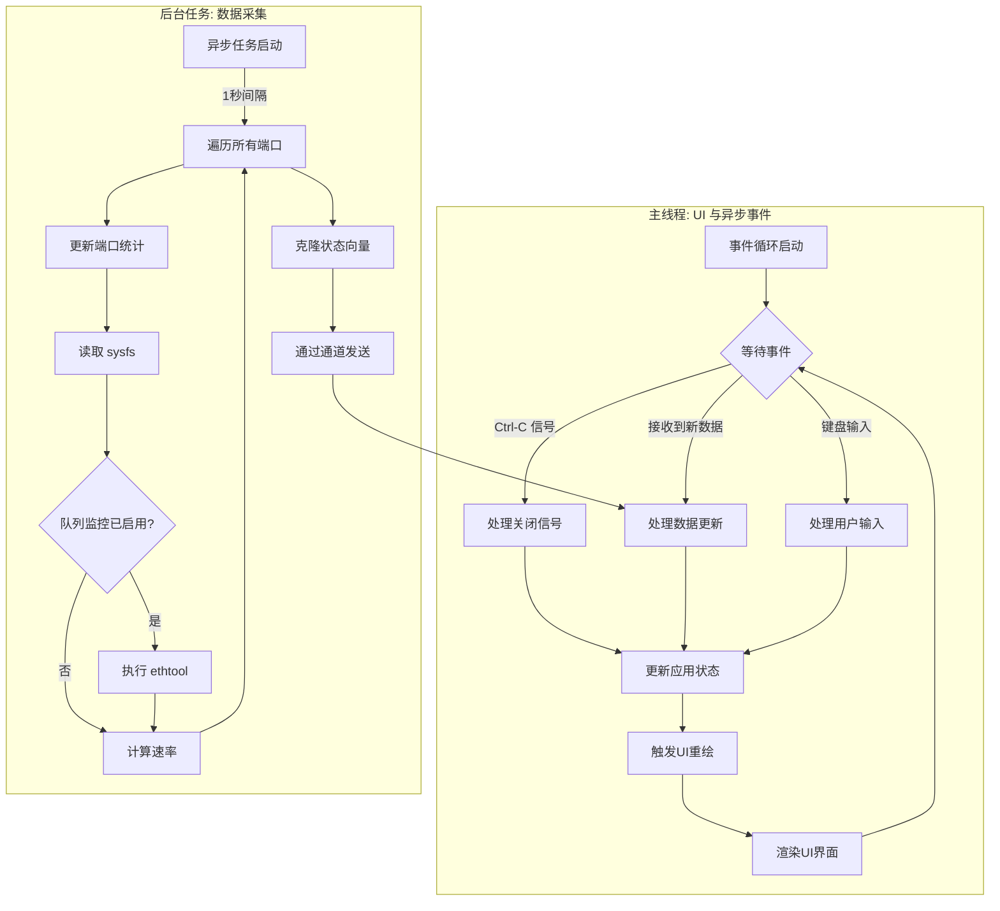

一个用于监控 RDMA/InfiniBand 端口统计的高性能 TUI（文本用户界面）。

该项目采用 Rust 实现，旨在提供一个响应迅速、信息密度高且零依赖的监控工具。它通过并发架构确保 UI 的流畅性，并通过动态布局最大限度地利用终端空间。


### 兼容性
*   **操作系统:** 本工具仅为 **Linux** 设计和测试。
*   **协议环境:** 主要在 **RoCE (RDMA over Converged Ethernet)** 环境下进行测试。虽然它可能在原生 InfiniBand 环境中工作，但其行为未经充分验证。

---

### 核心功能

*   **流量层面区分:** 清晰地将 **RDMA 协议层** (`RDMA RX/TX`) 流量与 **网络设备层** (`Prio RX/TX`) 流量分开展示，便于诊断流量性质。
*   **队列监控:** 可选的 `--monitor-queues` (`-q`) 标志，通过 `ethtool` 监控每个硬件优先级队列的 RX/TX 速率。
*   **状态高亮:**
    *   `ACTIVE`: 绿色
    *   `DOWN`: **红色** `DIE`
    *   其他状态 (如 `INIT`): 黄色

---

### 架构与数据流

为便于维护和二次开发，本节详细说明应用的内部工作流程。



#### 1. 核心状态 (`App` 结构体)

`App` 结构体是应用的核心，它持有所有**运行时状态**，例如端口数据列表 (`ports`)、当前的排序键 (`sort_key`)、退出标志 (`should_quit`) 等。
值得注意的是，像 `--monitor-queues` 这样的**一次性配置参数**，仅在应用初始化阶段 (`App::try_new`) 被使用，而**不会**被存储在 `App` 结构体中，从而保持了运行时状态的精简。

#### 2. 并发模型

应用采用由 `tokio` 驱动的多线程异步架构，将 UI 渲染与数据 I/O 彻底分离。

*   **UI 线程:** 负责处理用户输入和渲染 TUI。主循环通过 `tokio::select!` 宏异步等待多个事件源，从不阻塞，确保了界面的高响应性。
*   **数据采集任务:** 一个独立的 `tokio` 后台任务，以较低频率（1s）运行，负责所有耗时的 I/O 操作。

#### 3. 状态同步

*   **MPSC 通道:** UI 线程与数据采集任务之间通过 `tokio::sync::mpsc` 通道进行通信。
*   **单向数据流:** 数据仅从采集任务单向流向 UI 线程。
*   **状态克隆:** 每次更新时，采集任务会 `clone()` 整个端口状态向量 (`Vec<IBPort>`) 并通过通道发送。
    *   **设计权衡:** 此方法避免了使用锁 (`Mutex`) 带来的复杂性，简化了并发模型。

#### 4. 数据源

数据从以下两个来源获取，通过记录前一次的值和时间戳来计算速率。

1.  **Sysfs (`/sys/class/infiniband/`) -> `RDMA RX/TX`**
    *   **含义:** 此数据来自 **InfiniBand 协议栈**，衡量的是纯粹的 **RDMA 流量**。
    *   **用途:** 确认 RDMA 应用是否正在收发数据。

2.  **`ethtool` 命令 -> `Prio RX/TX`**
    *   **含义:** 此数据来自**网络设备驱动层**，统计流经该物理接口的**所有以太网帧**。
    *   **用途:** 监控物理链路的总流量，并验证 QoS 配置。

---

### 安装与使用

#### 从源码构建

1.  安装 [Rust 工具链](https://rust-lang.org/)。
2.  克隆并构建项目：
    ```bash
    git clone https://github.com/your-repo/rdma-dashboard.git
    cd rdma-dashboard
    cargo build --release
    ```
    可执行文件位于 `./target/release/rdma-dashboard`。

#### 使用示例

```bash
# 监控所有端口
./target/release/rdma-dashboard -a

# 监控所有端口并显示队列信息 (可能需要 sudo)
sudo ./target/release/rdma-dashboard -a -q

# 监控指定端口
./target/release/rdma-dashboard -i mlx5_0-1 mlx5_1-1
```

### 快捷键

| 按键 | 功能 |
|:---  |:---  |
| `q` / `Ctrl+C` | 退出 |
| `n`  | 按名称排序 |
| `r`  | 按 RX 速率排序 |
| `t`  | 按 TX 速率排序 |

---

### 未来方向 (TODO)

*   **性能优化 (`ethtool`):**
    *   **问题:** 当前通过执行 `ethtool` 子进程来获取队列数据，这是数据采集中资源开销最大的部分。
    *   **方向:** 未来版本可考虑提供一个可选的 `netlink` 后端，通过编译特性 (feature flag) 启用，以实现极致的性能并消除子进程依赖。

### 致谢

本项目基于一个初始的 Bash 脚本，在一个 AI Agent的帮助下一步重构而来。轻喷。
